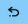
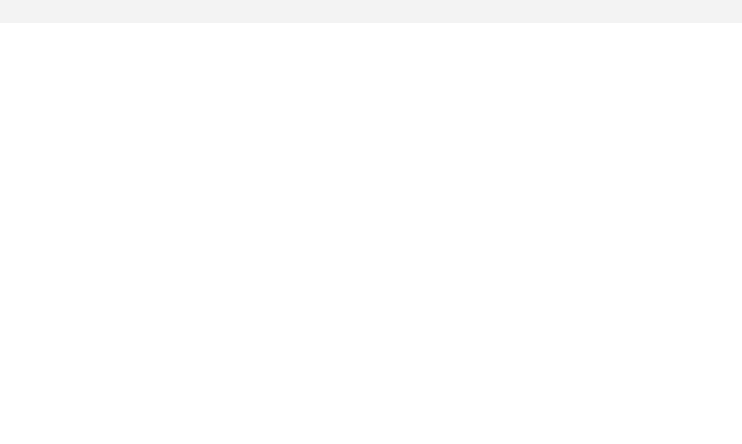
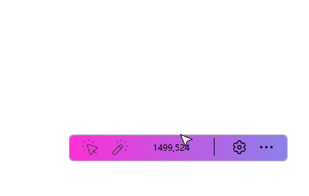
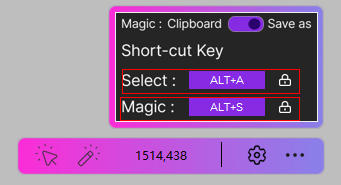
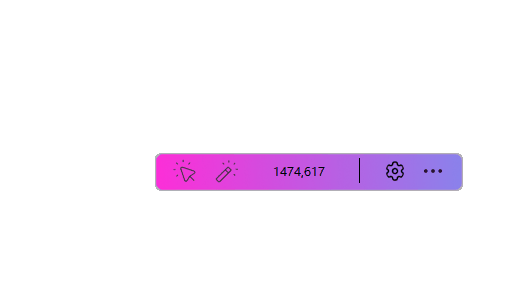

# MagicC — A tool for screenshot

Current stable version: **MagicC 1.0.0** (2026-10-09).

Build the Windows executable with `pyinstaller main.spec`. The EXE includes
Windows file/product version `1.0.0`. User credentials are stored in
`%USERPROFILE%\MagicC\.env` and are not included in the executable.

## 更新记录

### 1.0.0 — 2026-10-09

首个正式版本。

- 修复截图亮度补偿导致的色差，直接裁剪原始画面并绘制矩形标注。
- 增加二维码分享：支持局域网传输和 pCloud 云端分享。
- pCloud 使用摘要认证，自动创建 `/MagicC`，上传 PNG 并生成公开链接。
- UI 优化。
- 云端截图 24 小时后自动清理。
- 将后台触发的界面操作交给 Tk 主线程，倒计时改为非阻塞。
- GIF 增加可配置帧率、时长、倒计时和内存限制，修复单帧保存问题。
- 配置安全解析、固定存储路径、原子写入及异常处理。
- 首次运行自动在 `%USERPROFILE%\MagicC\config.ini` 创建初始化配置，后续保留用户设置。
- 设置增加 Share 的 Cloud / Local 切换，点击 Cloud 可创建并编辑用户目录中的 `.env`。
- 增加单实例限制，优化启动、退出和界面尺寸适配。
- 增加运行依赖说明、配置模板和回归测试。

已知限制：GIF 每帧最多 256 色；HDR 色彩转换尚未实现；全屏录制可能包含控制栏。
云端截图在 24 小时后自动删除，链接随之失效。程序需保持运行并联网，关闭或断网时下次启动联网后补做清理；旧截图不受影响。

## 设置与扫码分享

打开设置后，第一行 **Magic** 选择重复截图的处理方式：**Clipboard** 复制到剪贴板，
**Save as** 打开保存对话框。其下的 **Share** 选择二维码分享方式：

- **Local**（默认）：手机与电脑连接同一局域网，扫码后可长按图片或点击保存按钮下载 PNG。关闭扫码窗口或等待 10 分钟后，链接失效。
- **Cloud**：截图上传至 pCloud 的 `/MagicC` 文件夹，手机可跨网络访问。关闭扫码窗口不影响有效期；截图 24 小时后由程序删除，链接随之失效。

点击 **Cloud 文字** 打开 `%USERPROFILE%\MagicC\.env`，首次打开会生成账号、密码为空的模板。
填写 `PCLOUD_USERNAME`、`PCLOUD_PASSWORD` 并保存；下一次扫码分享会读取新配置，无需重启。
美国机房使用 `PCLOUD_API_HOST=api.pcloud.com`，欧洲机房使用 `PCLOUD_API_HOST=eapi.pcloud.com`。
密码包含空格或 `#` 时请加引号，模板中的密码默认不带引号。

选好截图区域后，点击工具栏的二维码按钮即可生成分享链接。
本地分享无法访问时，请检查 Windows 防火墙是否允许程序访问专用网络。

个人配置自动保存在 `%USERPROFILE%\MagicC\config.ini`，首次运行生成默认值，后续保留用户设置。
配置和云盘凭据独立于程序目录，更新 EXE 时无需重新填写。`dist/` 构建产物与 `.env` 不纳入 Git。

## pCloud screenshot sharing

In Settings, select Cloud on the Share row. Click the Cloud label to open Notepad;
the app creates `%USERPROFILE%\MagicC\.env` with blank credentials if missing. Set
`PCLOUD_USERNAME` and `PCLOUD_PASSWORD`. Set `PCLOUD_API_HOST=api.pcloud.com` for US
accounts or `PCLOUD_API_HOST=eapi.pcloud.com` for Europe. Quote passwords containing
spaces or `#` in the dotenv file. Authentication uses pCloud's digest flow over HTTPS:
`getdigest` followed by `userinfo` with `passworddigest`. The plaintext password is
not sent. If a successful response omits `auth`, subsequent requests use digest
credentials; a fresh digest is obtained for each share. Tokens, when returned, are
reused only in memory, and `.env` is excluded from Git.

After saving the file, the next QR share reads the new credentials without a restart.
Local is the default mode and always uses LAN sharing, even if credentials exist.
Cloud mode requires credentials and does not fall back silently to Local.
In Cloud mode, the QR toolbar button uploads the annotated PNG
to `/MagicC`, creating that folder if needed. Managed filenames include an expiry timestamp and a random
suffix, without subfolders. Only QR sharing uploads images; normal save/copy stays
local. The QR contains a public pCloud sharing link and works across networks.
MagicC checks every minute and deletes managed screenshots after 24 hours,
invalidating their links. It must be running and online; cleanup resumes after restart
or network recovery. Premium accounts additionally use pCloud server-side link expiry.
Basic accounts rely on the app, so links remain accessible until cleanup completes. Older screenshots and unrelated files are left untouched. An upload failure is shown explicitly, without switching silently
to LAN sharing. Source/EXE-adjacent `.env` files are no longer read; copy their
contents into the user file when upgrading.
Uploads run off the UI thread. Closing a loading window does not cancel an upload
already in progress. If link creation fails after upload, MagicC attempts to delete the PNG; failed deletions
are retried by the expiry sweep.

Test using `python -m unittest test_regressions test_pcloud -v`.

## Screenshot and recording fixes

Screenshots now crop the original screen pixels and render annotations directly onto
the output image. The dimmed selection overlay and brightness compensation no longer
affect exported colors. PNG preserves captured RGB pixels; JPEG and GIF are lossy
formats (GIF supports at most 256 colors per frame).

Run on Windows with `pip install -r requirements.txt` and `python main.py`.
Configuration is stored in `%USERPROFILE%\MagicC\config.ini` (for example,
`C:\Users\yourname\MagicC\config.ini`). The first run creates the directory and
default INI; subsequent runs retain user settings. Old INI files beside the source
or EXE are not read or imported. Optional settings
under `[DEFAULT]`: `gif_fps = 10`, `gif_max_seconds = 30`, `gif_countdown = 3`,
`share_mode = 1` (Local; `0` selects Cloud).
Recording also stops when retained palette-frame pixels reach approximately 128 MiB;
actual total memory includes capture buffers and encoding overhead. Automatic stop
opens the same save dialog as the stop button. Controls prefer space outside the
capture region; full-screen recording may include the recording controls.

Run regression checks with `python -m unittest test_regressions -v`.
In Local mode, the screenshot toolbar QR button shares the annotated PNG through
a temporary LAN HTTP server with a random URL. Scan using a phone on the same
network; close the QR window to stop sharing (automatic expiry: 10 minutes).
Windows Firewall may require allowing Python on private networks. Images stay
in memory and are not uploaded to an external service.
HDR/display color management is not converted by this tool; desktop captures may
still differ from perceived HDR display output.

## Historical notes: beta 0.2 (2024-10-13)

The following notes describe the old implementation; version 1.0.0 supersedes its
brightness-compensation workaround.

1. add a README.md file.

2. fix bug: shortcut key can not changed correctly. 

   file position：mainwin.py 

   row 42: .replace('Key,', '') change to .replace('Key.', '')

   row 52: key.char change to keyname

3. fix bug:  screenshot is darker than the actual.

   file position : shortcut.py

   row 88: add

   ```
   image = ImageEnhance.Brightness(image).enhance(1.33)
   ```

4. fix bug: screenshot has border.

   file position : shortcut.py

   row 232-235.

   ```python
   rightx, righty = max(self.startx, event.x), max(self.starty, event.y)
   self.shortcut_area = [(leftx + 1, lefty + 1),(rightx - 1, righty - 1)]
   image = Image.new('RGBA',(rightx-leftx,righty-lefty), (255, 255, 255, 0))
   self.rec_image = ImageTk.PhotoImage(ImageOps.expand(image, border=2, fill='#0378C1'))
   self.canvas.create_image(leftx, lefty, image=self.rec_image, anchor=tk.NW, tags='shortcut_area')
   
   ```

   change to

   ```python
   rightx, righty = max(self.startx, event.x), max(self.starty, event.y)
   self.shortcut_area = [(leftx, lefty),(rightx, righty)]
   image = Image.new('RGBA',(rightx - leftx, righty - lefty), (255, 255, 255, 0))
   self.rec_image = ImageTk.PhotoImage(ImageOps.expand(image, border=1, fill='#0378C1'))
   self.canvas.create_image(leftx-1, lefty-1, image=self.rec_image, anchor=tk.NW, tags='shortcut_area')
   ```

5. fix bug:  GIF only shows the first image.

   file position : gifwin.py

​	row 92:

```python
im.save(ask, save_all=True, append_iamges=img_list[1:], loop=0, duration=dur)
```

​	change to

```python
im.save(ask, save_all=True, append_images=img_list[1:], loop=0, duration=dur)
```

------


# How to use


##### 1.   the button to start screenshot. And right click to exit screenshot mode.


###### 1.1 toolbar.

undo mark

mark rectangle

recording gif

save screenshot

save to clipboard





##### 2. the button to get the same location as the previous screenshot. And you can choose to save mode or clipboard mode.


you can choose to save mode or clipboard mode at here.




3. ##### Shortcut Key. The above two buttons can be triggered by shortcut keys.

   

you can change it to your preference



